# blog-writer AI化优化方案设计

> 版本: v1.0
> 日期: 2026-07-27
> 目标: 将运营人员一天的工作，做成可控、可复用、可批量执行的AI工作流

---

## 一、优化目标

| 目标 | 说明 |
|------|------|
| **可控性** | 关键决策节点支持人工干预，可调整关键词、提示词等 |
| **可复用性** | 工作流模板化，支持多品牌、多场景复用 |
| **可批量执行** | 支持一次提交多个关键词，并行生成多篇文章 |
| **合规检查** | 系统自动自检 + 人工审核双重保障 |
| **风险分级** | 根据风险水平自动选择发布路径 |

---

## 二、运行模式设计

### 2.1 三种运行模式

| 模式 | 描述 | 适用场景 |
|------|------|----------|
| `auto` | 全自动模式，无人干预 | 低风险、标准化内容 |
| `supervised` | 关键节点人工审核 | 中等风险、需要质量把控 |
| `manual` | 每步人工确认 | 高风险、敏感内容 |

### 2.2 模式切换机制

在 `registry.json` 中新增 `mode` 参数，通过路由配置实现不同模式的流程切换。

---

## 三、目标架构图

```mermaid
graph TB
    subgraph 批量调度层
        A[BATCH-001 批量初始化]
        A --> B[S000-0 启动]
        A --> C[S000-1 启动]
        A --> D[S000-N 启动]
        B --> E[实例1]
        C --> F[实例2]
        D --> G[实例N]
        E --> H[BATCH-002 结果汇总]
        F --> H
        G --> H
    end
    
    subgraph 单个实例流程
        I[S000 启动] --> J[S001 BID推断]
        J --> K{S001H 人工审核}
        K -->|auto| L[S002 PRD]
        K -->|supervised| M[等待人工确认]
        M --> L
        L --> N[S003 结构] --> O[S004 正文]
        O --> P{S004H 人工审核}
        P -->|auto| Q[S005 字段化]
        P -->|supervised| R[等待人工确认]
        R --> Q
        Q --> S[S006 呈现] --> T[S007 视觉]
        T --> U[S008 自审] --> V[S009 Gate]
        V --> W{RK风险分级}
        W -->|RK<=2| X[S010 发布]
        W -->|RK>2| Y[人工审批]
        Y --> X
        X --> Z[S011 WP发布]
    end
    
    subgraph 人工干预点
        K2[S001H: BID审核]
        P2[S004H: 正文审核]
        Y2[S009H: Gate审批]
    end
    
    style K fill:#FFC107,color:black
    style P fill:#FFC107,color:black
    style W fill:#F44336,color:white
    style Y fill:#F44336,color:white
```



---

## 四、新增节点设计

### 4.1 S001H-human-review-bid.json

**作用**: BID推断后的人工审核节点

| 属性 | 值 |
|------|-----|
| id | step.blog.writer.human_review_bid |
| name | BID人工审核 |
| kind | human_review |
| seq | 1.5 |

**工作流**:
1. 读取 000 BID.json
2. 展示 BID 摘要、标题、关键词、SEO信息
3. 等待人工操作：
   - 通过 → 继续 S002
   - 修改关键词 → 更新 BID 并重跑 S001
   - 修改标题 → 更新 BID
   - 修改提示词 → 更新 user_note

### 4.2 S004H-human-review-draft.json

**作用**: 正文写作后的人工审核节点

| 属性 | 值 |
|------|-----|
| id | step.blog.writer.human_review_draft |
| name | 正文人工审核 |
| kind | human_review |
| seq | 4.5 |

**工作流**:
1. 读取 004 正文.md 和 008 自审结果.md
2. 展示正文预览和评分结果
3. 等待人工操作：
   - 通过 → 继续 S005
   - 修改内容 → 更新正文并重跑 S004
   - 修改提示词 → 更新 user_note 并重跑 S004
   - 修改标题 → 更新 BID 并重跑

### 4.3 S-BATCH-001-batch-init.json

**作用**: 批量任务初始化节点

| 属性 | 值 |
|------|-----|
| id | step.blog.writer.batch_init |
| name | 批量任务初始化 |
| kind | agent_action |
| seq | -1 |

**工作流**:
1. 读取 batch-config.json
2. 解析关键词列表
3. 为每个关键词 spawn 独立实例
4. 记录任务进度

### 4.4 S-BATCH-002-batch-collect.json

**作用**: 批量任务结果汇总节点

| 属性 | 值 |
|------|-----|
| id | step.blog.writer.batch_collect |
| name | 批量结果汇总 |
| kind | agent_action |
| seq | 12 |

**工作流**:
1. 收集所有实例的状态
2. 生成汇总报告
3. 统计成功/失败/待审核数量

---

## 五、路由变更表

### 5.1 auto 模式路由（全自动）

| 步骤 | on_pass | on_fail | max_retries |
|------|---------|---------|-------------|
| S000 | S001 | S000 | 2 |
| S001 | S002 | S001 | 3 |
| S002 | S003 | S002 | 3 |
| S003 | S004 | S003 | 3 |
| S004 | S005 | S004 | 3 |
| S005 | S006 | S005 | 3 |
| S006 | S007 | S006 | 2 |
| S007 | S008 | S007 | 2 |
| S008 | S009 | S004 | 3 |
| S009 | S010 | S004 | 2 |
| S010 | S011 | S010 | 1 |
| S011 | 完成 | S011 | 2 |

### 5.2 supervised 模式路由（关键节点审核）

| 步骤 | on_pass | on_fail | 备注 |
|------|---------|---------|------|
| S000 | S001 | S000 | |
| S001 | S001H | S001 | BID审核 |
| S001H | S002 | S001 | 人工确认后继续 |
| S002 | S003 | S002 | |
| S003 | S004 | S003 | |
| S004 | S004H | S004 | 正文审核 |
| S004H | S005 | S004 | 人工确认后继续 |
| S005 | S006 | S005 | |
| S006 | S007 | S006 | |
| S007 | S008 | S007 | |
| S008 | S009 | S004 | |
| S009 | S009H | S004 | Gate审批 |
| S009H | S010 | S004 | 人工审批后继续 |
| S010 | S011 | S010 | |
| S011 | 完成 | S011 | |

### 5.3 manual 模式路由（每步确认）

在 supervised 模式基础上，每个步骤后都增加人工确认节点。

---

## 六、风险分级策略

### 6.1 风险等级定义（基于 BID RK 字段）

| RK值 | 风险等级 | 描述 | 处理策略 |
|------|---------|------|----------|
| 01 | 低风险 | 通用知识、教育内容 | 全自动发布 |
| 02 | 中低风险 | 产品介绍、使用指南 | 自动发布 + 事后审核 |
| 03 | 中风险 | 对比评测、行业分析 | 人工审核后发布 |
| 04 | 中高风险 | 技术指南、实操教程 | 强制人工审批 |
| 05 | 高风险 | 敏感话题、争议内容 | 多级审批 + 法务审核 |

### 6.2 风险路由逻辑

```
S009 Gate校验完成
    │
    ├─ RK ≤ 02 → S010 发布包（全自动）
    │
    ├─ RK = 03 → S009H 人工审批（单级）
    │              │
    │              └─ 通过 → S010
    │
    └─ RK ≥ 04 → S009H 人工审批（多级）
                   │
                   ├─ 一级审批 → 二级审批
                   │              │
                   │              └─ 通过 → S010
                   │
                   └─ 驳回 → S004 改正文
```

---

## 七、人工审核节点交互设计

### 7.1 审核界面结构

```
┌─────────────────────────────────────────────────────────┐
│  📋 审核任务: BID人工审核                                │
│  ────────────────────────────────────────────────────── │
│                                                         │
│  📊 当前状态                                             │
│  ├─ 关键词: SMS marketing API, bulk SMS                 │
│  ├─ 标题: The Ultimate Guide to SMS Marketing API       │
│  ├─ Slug: ultimate-guide-sms-marketing-api              │
│  └─ 风险等级: 中风险 (RK=03)                            │
│                                                         │
│  ✅ AI建议                                               │
│  ├─ BID摘要: CO(01,02...) WB(03...) SE(04...)          │
│  ├─ SEO标题: 5 Essential Tips for SMS API Integration   │
│  └─ Meta描述: Learn how to integrate SMS API...         │
│                                                         │
│  🎯 操作选项                                             │
│  ├─ [✓ 通过] 直接进入下一步                              │
│  ├─ [✏ 修改关键词] 重新输入关键词                        │
│  ├─ [✏ 修改标题] 调整文章标题                            │
│  └─ [✏ 修改提示词] 更新写作要求                          │
│                                                         │
│  📝 修改输入框（选中操作后显示）                          │
│  └─ ___________________________                         │
│                                                         │
│  [确认并继续]  [驳回并返回修改]                           │
└─────────────────────────────────────────────────────────┘
```

### 7.2 审核数据结构

```json
{
  "review_id": "review-001",
  "step_id": "step.blog.writer.human_review_bid",
  "instance_id": "blog-writer-20260727-103000",
  "review_type": "bid",
  "status": "pending",
  "data": {
    "keywords": "SMS marketing API, bulk SMS",
    "title": "The Ultimate Guide to SMS Marketing API",
    "slug": "ultimate-guide-sms-marketing-api",
    "risk_level": "medium",
    "bid_summary": "CO(01,02...) WB(03...) SE(04...)",
    "ai_suggestions": []
  },
  "user_actions": {
    "action": "approve",
    "modified_keywords": "",
    "modified_title": "",
    "modified_note": "",
    "comments": "关键词合适，标题需要优化"
  },
  "timestamp": "2026-07-27T10:30:00Z"
}
```

---

## 八、批量调度设计

### 8.1 batch-config.json 模板

```json
{
  "batch_id": "batch-20260727-001",
  "name": "SMS营销系列文章",
  "mode": "supervised",
  "brand_path": "/path/to/brands/sms-boosting/",
  "brand_site_url": "https://smsboosting.com",
  "tasks": [
    {
      "task_id": "task-001",
      "keywords": "SMS marketing API integration",
      "user_note": "技术受众，突出API易用性",
      "priority": "high"
    },
    {
      "task_id": "task-002",
      "keywords": "bulk SMS best practices",
      "user_note": "运营受众，实用技巧",
      "priority": "medium"
    },
    {
      "task_id": "task-003",
      "keywords": "SMS gateway comparison",
      "user_note": "对比评测，客观中立",
      "priority": "medium"
    }
  ],
  "max_parallel": 3,
  "auto_retry": true
}
```

### 8.2 批量状态跟踪

```json
{
  "batch_id": "batch-20260727-001",
  "status": "running",
  "total_tasks": 3,
  "completed_tasks": 1,
  "pending_tasks": 1,
  "review_tasks": 1,
  "failed_tasks": 0,
  "progress": 33,
  "tasks": [
    {
      "task_id": "task-001",
      "status": "completed",
      "instance_path": "instance/blog-writer-20260727-100000",
      "output_file": "007 发布包.md"
    },
    {
      "task_id": "task-002",
      "status": "pending",
      "instance_path": "instance/blog-writer-20260727-101000"
    },
    {
      "task_id": "task-003",
      "status": "review",
      "instance_path": "instance/blog-writer-20260727-102000",
      "review_step": "S001H"
    }
  ],
  "started_at": "2026-07-27T10:00:00Z",
  "estimated_completion": "2026-07-27T14:00:00Z"
}
```

---

## 九、实施步骤

| 阶段 | 任务 | 预期时间 |
|------|------|----------|
| Phase 1 | 新增人工审核节点 (S001H, S004H, S009H) | 2天 |
| Phase 2 | 修改 registry.json 添加模式路由 | 1天 |
| Phase 3 | 新增批量调度节点 (S-BATCH-001, S-BATCH-002) | 2天 |
| Phase 4 | 实现风险分级路由逻辑 | 1天 |
| Phase 5 | 测试验证 | 2天 |

---

## 十、兼容性说明

- 现有节点文件保持不变，通过新增节点实现扩展
- 路由配置向后兼容，默认使用 auto 模式
- 批量模式为可选功能，不影响单任务流程
- 人工审核节点的 kind 为 `human_review`，需要框架支持该类型

---

## 十一、安全与合规

| 措施 | 说明 |
|------|------|
| 禁用词检测 | 自动检测品牌禁用词，命中则拦截 |
| URL验证 | 验证引用来源的真实性 |
| 风险分级 | 高风险内容强制人工审核 |
| 审计日志 | 记录所有人工操作和决策 |
| 权限控制 | 不同审核节点需要不同权限 |

---

## 十二、扩展方向

- [ ] 支持多语言写作（基于 LO 字段）
- [ ] 集成社交媒体发布（微信公众号、微博等）
- [ ] 添加数据分析模块（阅读量、转化率追踪）
- [ ] 支持 A/B 测试（不同标题/内容版本对比）
- [ ] 智能选题建议（基于历史数据和热点）
