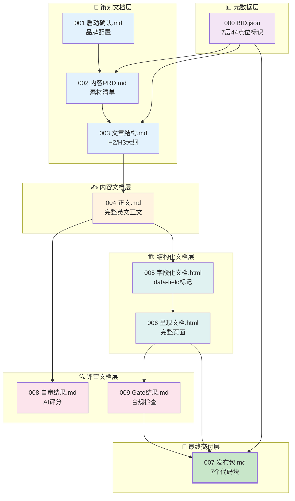
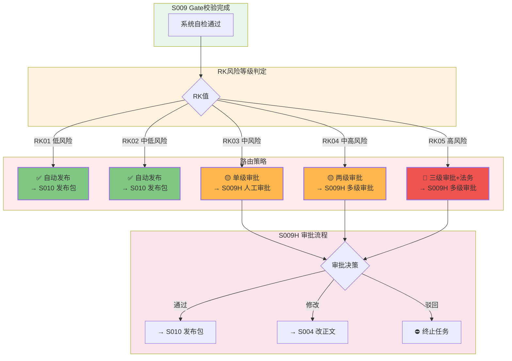

# Blog-Writer 架构流程图

> 最后更新：2026-08-12

---

## 📊 整体架构流程图（Mermaid）

```mermaid
flowchart TD
    subgraph 入口["🎯 任务入口"]
        A[用户请求] --> B{启动初始化}
    end

    subgraph 初始化阶段["📦 初始化阶段"]
        B -->|S000| C{品牌初始化}
        C -->|产出: 001 启动确认.md| D{BID自动推断}
    end

    subgraph BID阶段["🔖 BID标识阶段"]
        D -->|S001| E{生成7层44点位标识}
        E -->|产出: 000 BID.json| F{🟡 BID人工审核}
        F -->|S001H| G{人工决策: 通过/修改/重新推断}
    end

    subgraph 内容策划阶段["📝 内容策划阶段"]
        G -->|通过| H{内容方案生成}
        H -->|S002| I{产出: 002 内容PRD.md}
        I --> J{文章结构生成}
        J -->|S003| K{产出: 003 文章结构.md}
    end

    subgraph 写作阶段["✍️ 正文写作阶段"]
        K --> L{正文写作}
        L -->|S004| M{产出: 004 正文.md}
        M --> N{🟡 正文人工审核}
        N -->|S004H| O{人工决策: 通过/修改/重写}
        O --> P{内容质量校验}
        P -->|S004-content-validate| Q{校验通过?}
    end

    subgraph 结构化阶段["🏗️ 结构化阶段"]
        Q -->|通过| R{字段化处理}
        R -->|S005| S{产出: 005 字段化文档.html}
        S --> T{呈现文档生成}
        T -->|S006| U{产出: 006 呈现文档.html}
        U --> V{视觉素材生产}
        V -->|S007| W{产出: 含Mermaid/图片的HTML}
    end

    subgraph 评审阶段["🔍 评审校验阶段"]
        W --> X{AI自审+打分}
        X -->|S008| Y{产出: 008 自审结果.md}
        Y --> Z{🔴 Gate校验}
        Z -->|S009| AA{系统自检: 禁用词/URL/合规}
    end

    subgraph 审批阶段["⚠️ 风险审批阶段"]
        AA --> AB{风险等级判定}
        AB -->|RK≤02 低风险| AC{→ 直接发布}
        AB -->|RK≥03 中/高风险| AD{🟡 Gate人工审批}
        AD -->|S009H| AE{多级审批: 单级/两级/三级}
    end

    subgraph 发布阶段["🚀 发布阶段"]
        AC --> AF{发布包组装}
        AE -->|通过| AF
        AF -->|S010| AG{产出: 007 发布包.md}
        AG --> AH{WordPress发布}
        AH -->|S011| AI[🎉 发布完成]
    end

    style 入口 fill:#e1f5fe
    style 初始化阶段 fill:#fff3e0
    style BID阶段 fill:#fff9c4
    style 内容策划阶段 fill:#f1f8e9
    style 写作阶段 fill:#e8f5e9
    style 结构化阶段 fill:#e0f7fa
    style 评审阶段 fill:#fce4ec
    style 审批阶段 fill:#ffebee
    style 发布阶段 fill:#f3e5f5

    classDef review fill:#ffb74d,stroke:#ff6f00,stroke-width:2px,color:#000
    classDef risk fill:#ef5350,stroke:#b71c1c,stroke-width:3px,color:#fff
    classDef check fill:#81c784,stroke:#2e7d32,stroke-width:2px,color:#fff
    classDef output fill:#64b5f6,stroke:#1565c0,stroke-width:2px,color:#fff

    class F,N,AD review
    class AA risk
    class Q,AE check
    class C,E,I,K,M,S,U,W,Y,AG output
```



---

## 🎯 关键节点标识

### 🔴 高风险节点（必须人工审核）

| 节点ID | 节点名称 | 风险等级 | 说明 |
|--------|----------|----------|------|
| S009 | Gate校验 | 🔴 高 | 合规检查、禁用词检测、URL验证 |
| S009H | Gate人工审批 | 🔴 高 | RK≥03必须经过，RK≥04多级审批 |

### 🟡 人工审核节点（关键决策点）

| 节点ID | 节点名称 | 触发模式 | 审核内容 |
|--------|----------|----------|----------|
| S001H | BID人工审核 | supervised/manual | 关键词、标题、提示词 |
| S004H | 正文人工审核 | supervised/manual | 内容、结构、风格 |
| S009H | Gate人工审批 | RK≥03或manual | 最终发布决策 |

### ✅ 质量检查节点

| 节点ID | 节点名称 | 检查内容 | 失败处理 |
|--------|----------|----------|----------|
| S004-content-validate | 内容质量校验 | 结构、引用、关键词密度 | 回退重写 |
| S008 | AI自审+打分 | 原创度、可信度、深度 | 回退修改 |
| S009 | Gate校验 | 禁用词、URL、格式洁净度 | 回退修改 |

---

## 🔄 三种运行模式流程图

```mermaid
flowchart LR
    subgraph auto模式["⚡ 全自动模式"]
        A1[S000 启动] --> A2[S001 BID] --> A3[S002 PRD] --> A4[S003 结构] --> A5[S004 正文]
        A5 --> A6[S005 字段化] --> A7[S006 呈现] --> A8[S007 视觉] --> A9[S008 自审]
        A9 --> A10{S009 Gate}
        A10 -->|RK≤02| A11[S010 发布包] --> A12[S011 发布]
    end

    subgraph supervised模式["👁️ 监督模式"]
        B1[S000 启动] --> B2[S001 BID] --> B3{🟡 BID审核} --> B4[S002 PRD] --> B5[S003 结构] --> B6[S004 正文]
        B6 --> B7{🟡 正文审核} --> B8[S004 校验] --> B9[S005 字段化] --> B10[S006 呈现] --> B11[S007 视觉] --> B12[S008 自审]
        B12 --> B13{S009 Gate}
        B13 -->|RK≤02| B14[S010 发布包]
        B13 -->|RK≥03| B15{🟡 Gate审批} --> B14
        B14 --> B16[S011 发布]
    end

    subgraph manual模式["✋ 手动模式"]
        C1[S000 启动] --> C2{🟡 每步确认} --> C3[S001 BID] --> C4{🟡 BID审核} --> C5[S002 PRD]
        C5 --> C6{🟡 每步确认} --> C7[S003 结构] --> C8{🟡 每步确认} --> C9[S004 正文]
        C9 --> C10{🟡 正文审核} --> C11[S004 校验] --> C12[S005 字段化]
        C12 --> C13{🟡 每步确认} --> C14[S006 呈现] --> C15[S007 视觉]
        C15 --> C16{🟡 每步确认} --> C17[S008 自审] --> C18{S009 Gate}
        C18 --> C19{🟡 Gate审批} --> C20[S010 发布包] --> C21[S011 发布]
    end

    style auto模式 fill:#c8e6c9
    style supervised模式 fill:#fff9c4
    style manual模式 fill:#ffccbc

    classDef review fill:#ffb74d,stroke-width:2px
    class B3,B7,B15,C2,C4,C6,C8,C10,C13,C16,C19 review
```



---

## 🏷️ 关键产出物流程图



---

## ⚠️ 风险分级路由图



---

## 📋 节点状态说明

| 图标 | 含义 | 触发条件 |
|------|------|----------|
| 🟡 | 人工审核节点 | supervised/manual模式 或 RK≥03 |
| 🔴 | 高风险节点 | Gate校验、高风险审批 |
| ✅ | 自动通过 | 低风险内容、自动模式 |
| ⛔ | 终止任务 | 人工驳回 |

---

## 🎯 核心特性标识

| 特性 | 说明 | 实现位置 |
|------|------|----------|
| **BID驱动** | 7层44点位标识，每步决策基于BID | S001 + registry.json |
| **隔离评审** | 自审/Gate使用独立session，不继承上下文 | S008 + S009 |
| **风险分级** | RK01-RK05五级风险策略 | registry.json risk_strategy |
| **模式切换** | auto/supervised/manual三种运行模式 | registry.json mode_config |
| **批量调度** | 支持多任务并行，自动汇总 | S-BATCH-001/002 |
| **品牌管理** | 下拉选择 + 上传新品牌（中文转拼音） | api/brands.py + web/js/brands.js |
| **断点续跑** | failed/cancelled/paused 均可从断点继续 | workflow_service.py |
| **检查分级** | hard_fail 阻塞 / pass=false 仅警告 | base_executor.py _run_checks |
| **审计日志** | 所有操作记录，便于追溯 | workflow_service.py |

---

## 🏗️ 技术架构

```
前端（纯静态 HTML/JS）
  ├── index.html          主页面
  ├── js/brands.js        品牌下拉/上传
  ├── js/app.js           应用主逻辑
  └── js/api.js           API封装
        │
        ▼ HTTP REST API
FastAPI（blog_writer/main.py）
  ├── api/tasks.py        任务接口（12个，免登录）
  ├── api/brands.py       品牌接口（2个，免登录）
  ├── api/admin.py        管理接口（需登录）
  └── api/deps.py         认证依赖
        │
        ▼
WorkflowService（workflow_service.py）
  ├── 任务编排 / 状态管理 / 断点续跑
  ├── WorkflowRouter（registry.routing 图导航）
  └── TaskLogger（日志节流保存）
        │
        ▼
Agent执行层
  ├── executor.py         Agent执行器（ReAct循环）
  ├── base_executor.py    基础执行器（checks分级）
  └── tools.py            工具注册（web_search/run_script/write_file等）
        │
        ▼
数据层
  ├── db.py               SQLite/PostgreSQL/MySQL
  ├── config_manager.py   配置管理
  └── LLM Provider        DeepSeek/OpenAI兼容
```

---

## 📊 流程统计

| 指标 | 数量 |
|------|------|
| 总节点数 | 18个（16工作流+2批量） |
| 工作流步骤 | 16步（含3个人工审核） |
| auto模式实际执行 | 13步（跳过人工审核） |
| 人工审核节点 | 3个 (S001H/S004H/S009H) |
| 质量检查点 | 5个 |
| 风险等级 | 5级 (RK01-RK05) |
| 产出文件 | 8个核心文件 |
| 支持模式 | 3种 (auto/supervised/manual) |
| 批量并发 | 最多5个并行任务 |

---

## 🔗 相关文档

- [ARCHITECTURE.md](ARCHITECTURE.md) - 详细架构说明
- [运营操作指南](../docs/运营操作指南.md) - 运营人员使用手册
- [平台对接文档](../docs/平台对接文档.md) - 开发对接文档
- [optimize-design.md](optimize-design.md) - 优化设计方案
